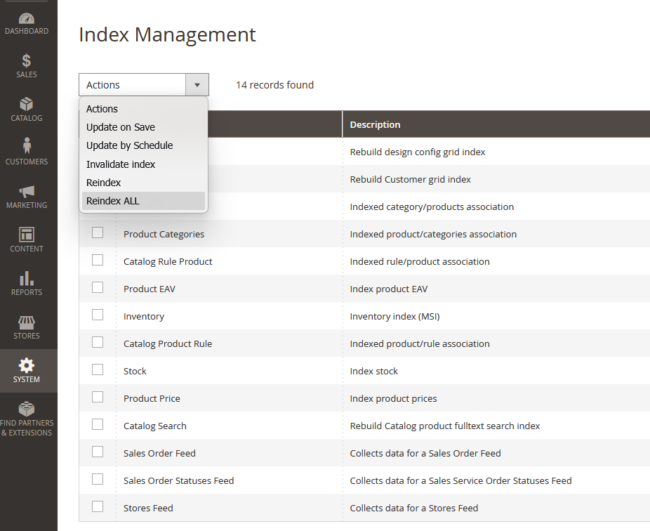

# MB_AdminReindex

[](https://github.com/marvikonvic/MB_AdminReindex)
[](https://github.com/marvikonvic/MB_AdminReindex)
[](https://www.php.net/)
[](LICENSE)

Magento 2 Admin module that adds **Reindex** and **Reindex ALL** actions below
**Invalidate index** in **System → Tools → Index Management**.



## Zašto je modul dobar za Magento admine?

Modul je koristan zato što adminima omogućava da:

- pokrenu **Reindex** samo za izabrane indekse;
- pokrenu **Reindex ALL** bez selektovanja redova;
- osveže katalog i pretragu direktno iz Admin panela, bez terminala;
- koriste postojeću Magento **Index Management** ACL dozvolu;
- dobiju jasne poruke o uspešnim, preskočenim i neuspešnim indeksima.

Modul automatski prati Magento zavisnosti između indeksera, obrađuje shared indekse
samo jednom po zahtevu i ne prekida obradu svih ostalih indeksera ako jedan indeks
ne uspe.

## Testiranje i kompatibilnost

Modul je testiran na staging okruženju sa:

- Magento Open Source **2.4.7-p3**
- PHP 8.1, 8.2 i 8.3

Staging test obuhvata prikaz Admin menija, ACL pristup, reindeksiranje izabranih
indeksera, **Reindex ALL** bez selekcije i obradu Magento dependency/shared-index
scenarija.

## Instalacija

Kopirajte modul u `app/code/MB/AdminReindex`, zatim pokrenite:

```bash
bin/magento module:enable MB_AdminReindex
bin/magento setup:upgrade
bin/magento cache:clean
```

U production modu deployujte Admin static content prema proceduri projekta.

Full Access administratori imaju pristup automatski. Za ograničene Admin role
dodelite **System → Tools → Index Management**. Modul nema posebnu ACL dozvolu.

## Napomena za rad

Admin reindeksiranje se izvršava sinhrono u web zahtevu. Kod velikih kataloga
web-server ili PHP timeout može biti prekoračen; za velike production kataloge
koristite CLI komandu:

```bash
bin/magento indexer:reindex
```

---

# MB_AdminReindex (English)

Magento 2 Admin module that adds **Reindex** and **Reindex ALL** actions below
**Invalidate index** in **System → Tools → Index Management**.


## Why is this module useful for Magento admins?

The module helps Magento admins to:

- run **Reindex** only for selected indexers;
- run **Reindex ALL** without selecting grid rows;
- refresh catalog and search data directly from the Admin panel, without terminal access;
- use Magento's existing **Index Management** ACL permission;
- receive clear messages for successful, skipped and failed indexers.

The module follows Magento's native indexer dependencies, processes shared indexes
only once per request, and continues with the remaining indexers when one indexer fails.

## Testing and compatibility

The module was tested on a staging environment with:

- Magento Open Source **2.4.7-p3**
- PHP 8.1, 8.2 and 8.3

The staging test covered the Admin menu, ACL access, selected-indexer reindexing,
**Reindex ALL** without a selection, and Magento dependency/shared-index scenarios.

## Installation

Copy the module to `app/code/MB/AdminReindex`, then run:

```bash
bin/magento module:enable MB_AdminReindex
bin/magento setup:upgrade
bin/magento cache:clean
```

In production mode, deploy Admin static content according to the project's deployment process.

Full Access administrators can use the actions automatically. For restricted Admin roles,
grant **System → Tools → Index Management**. There is no separate module-specific ACL resource.

## Operational note

Admin reindexing runs synchronously in the web request. Large catalogs may exceed PHP or
web-server timeouts; for large production catalogs, use:

```bash
bin/magento indexer:reindex
```

## License

Copyright © 2026 MB_AdminReindex contributors.

This module is licensed under the **GNU General Public License v3.0 only**.
See the [`LICENSE`](LICENSE) file for the complete terms.
